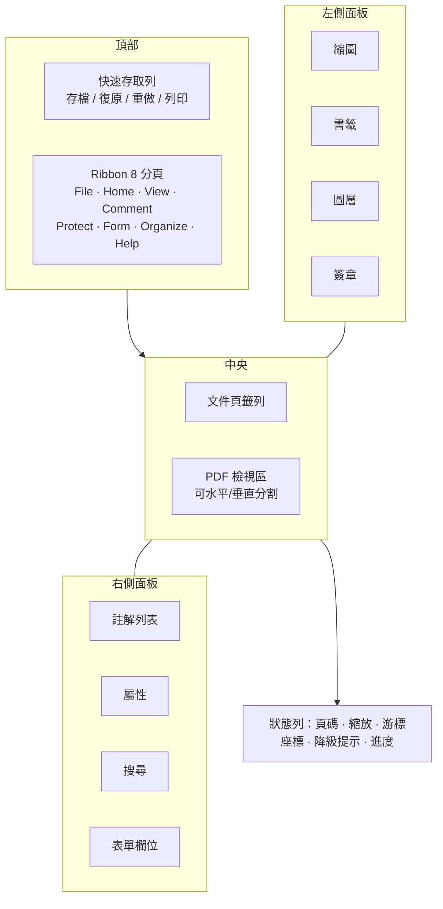
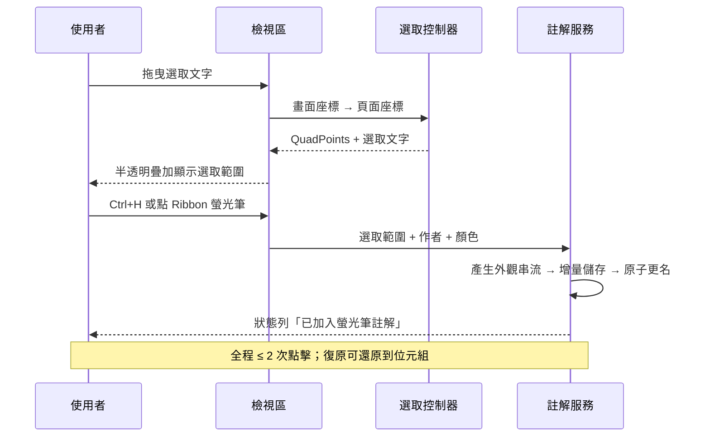

# Alioth UX 概念設計與資訊架構

| 項目 | 內容 |
|---|---|
| 對應 WBS | 1.9 |
| 上游契約 | PRD v2.1 §7、§3.2（Persona） |
| 狀態 | M0 概念定案，細部視覺規範待補 |

PRD §7.4 標記 Wireframe / Figma 為待確認。本文件以文字與 Mermaid 建立資訊架構與兩種
預設佈局的骨架，讓 M0 Gate 有可審查的產出；像素級視覺規範屬 M1 的事。
圖表一律用 Mermaid，不引入外部圖片（PRD §12 文件規範）。

---

## 1. 設計立場

產品叫「審閱工作站」不叫「編輯器」，這個定位必須在介面上看得出來，而不是只寫在官網上。

三條由此推出的設計規則：

**功能邊界要主動可見，不是等使用者撞牆。** 開啟含 XFA、JavaScript、3D 註解的文件時，
狀態列立刻顯示明確的降級說明；文件屬性對話框列出「注意」欄位。使用者不該在編輯半天後
才發現改不了內文。

**審閱動作優先於一切。** 螢光筆、便利貼、量測、回覆這幾個動作，任何時候都不該超過兩次點擊。
Ribbon 的 Home 分頁預設就是審閱工具，不是檔案操作。

**大型文件的等待要有形狀。** 500 頁工程圖捲動時，未渲染的區域顯示頁面白底與邊框而不是空白，
讓使用者知道「那裡有一頁，正在算」而不是「那裡沒有東西」。

---

## 2. 資訊架構



面板的左右分工有個簡單的規則：**左側是「文件的哪裡」，右側是「這裡有什麼」**。
縮圖、書籤、圖層回答導覽問題；註解、屬性、搜尋結果、欄位回答內容問題。
使用者要找路往左看，要看細節往右看。

---

## 3. 兩種預設佈局

PRD §7.4 要求首次啟動提供「精簡／專業」兩種預設。它們的差別不是「功能多寡」，
而是**預設展開了哪些面板**——功能一直都在，只是不佔畫面。

### 3.1 精簡（Reading）

```
+--------------------------------------------------+
| QAT: 存檔 復原 重做 | Ribbon（收合狀態）          |
+--------------------------------------------------+
|                                                  |
|                                                  |
|              PDF 檢視區（全寬）                   |
|                                                  |
|                                                  |
+--------------------------------------------------+
| 第 12 / 340 頁      120%      含數位簽章          |
+--------------------------------------------------+
```

Ribbon 預設收合（只留分頁標題），沒有停靠面板。適合 Persona P3 研究工作者 Ken：
論文閱讀、偶爾螢光筆摘錄。需要面板時從 View 分頁叫出來，用完再收。

### 3.2 專業（Review）

```
+--------------------------------------------------+
| QAT | Ribbon（展開，Home 分頁）                   |
+--------------------------------------------------+
| 縮圖  |                              | 註解列表   |
| 書籤  |     PDF 檢視區                | 屬性       |
|       |                              |            |
|       |                              |            |
+--------------------------------------------------+
| 第 12 / 340 頁  120%  X:210 Y:297mm  未存檔       |
+--------------------------------------------------+
```

左右面板各展開一組，Ribbon 展開。適合 Persona P1 工程審圖者 Alex 與 P2 法務審閱者 Mia：
需要同時看縮圖導覽與註解列表。

### 3.3 為什麼不做第三種

「自訂」不是預設佈局，而是從這兩種之一調整後儲存為 Session（PRD-UI-012）。
提供三種以上的預設只會讓首次啟動的選擇變成一道沒有正確答案的題目。

---

## 4. 關鍵流程

### 4.1 文字標記（最高頻動作）



失敗路徑同樣重要：文件權限不允許加註時，螢光筆工具在 Ribbon 上就是停用狀態並附提示，
不是點下去才跳錯誤（PRD-SEC-001 要求受限操作在 UI 灰化）。

### 4.2 大型文件的首次開啟

使用者感知的「開得快」不是整份載入完，而是**首頁出現得快**。因此開檔流程是：

1. 解析文件結構、取得頁數 → 立刻顯示第一頁的白底頁框與頁碼
2. 渲染第一頁的可見圖磚 → 逐塊填入（PRD §8.1：≤ 2 秒 P95）
3. 背景補：前 32 頁的尺寸、書籤樹、前 24 頁縮圖、可見範圍的註解

第 3 步全部是低優先權，任何時候使用者的捲動都會插隊到前面。

### 4.3 縮放

滾輪縮放時畫面必須立刻有反應，即使那個反應是暫時拉伸的舊圖磚。
停止 80 毫秒後以精確倍率重算取代（PRD §4.3 明令不得以拉伸結果作為最終畫面）。

這個 80 毫秒是刻意的：比它短會在連續縮放時排出大量註定被丟棄的渲染，
比它長使用者會察覺到「停下來之後才變清楚」的延遲。

---

## 5. 狀態與回饋

| 狀態 | 呈現方式 | 為什麼 |
|---|---|---|
| 載入中 | 頁框 + 白底，無轉圈圖示 | 轉圈圖示會蓋住即將出現的內容；頁框已經傳達「這裡有一頁」 |
| 空（無書籤／無註解） | 面板內一行說明文字 | 空白面板讓人以為壞了 |
| 錯誤（開檔失敗） | 對話框 + 具體原因 | 「無法開啟」沒有資訊量，要說「密碼錯誤」或「交叉參照表損壞，已嘗試重建」 |
| 降級（XFA / JS / 混合模式） | 狀態列常駐 + 文件屬性列出 | 不可誤導（PRD §13）；使用者要能查到為什麼看起來不對 |
| 未存檔 | 狀態列 + 標題列星號 | 兩處是刻意冗餘：狀態列在視線內，標題列在切換視窗時可見 |

PRD-UI_Spec 要求每個畫面定義 loading / empty / error 三態，上表是全域規則；
個別面板的三態在 UI_Spec 契約中逐一定義（M1 交付）。

---

## 6. 無障礙（PRD-A11Y-005，M 優先級）

- 全鍵盤可達：Ribbon 的 KeyTips（Alt 兩層）已實作；面板間以 F6 循環
- 螢幕閱讀器：Windows UIA。檢視區要回報當前頁碼與縮放，而不是把整份文件當一張圖片
- 高對比：所有顏色取自 QPalette 角色，不寫死。夜間模式與高對比是兩件事，不可互相取代
- 焦點可見：鍵盤焦點框不得被自訂繪製蓋掉——這在自研 Ribbon 上特別容易發生

---

## 7. 尚未決定

- 圖示語彙：目前用 Qt 主題圖示，未定義自有圖示集。影響 Ribbon 的視覺一致性
- 觸控最佳化的具體尺寸（PRD-UI-013）：需要實機驗證點按目標大小
- 多語系的版面伸縮：繁中與英文的字串長度差異在 Ribbon 群組標題上會造成換行，未處理
- Figma 檔：本文件用文字與 Mermaid 建立骨架，視覺稿仍待補（PRD §7.4 標記為待確認）
